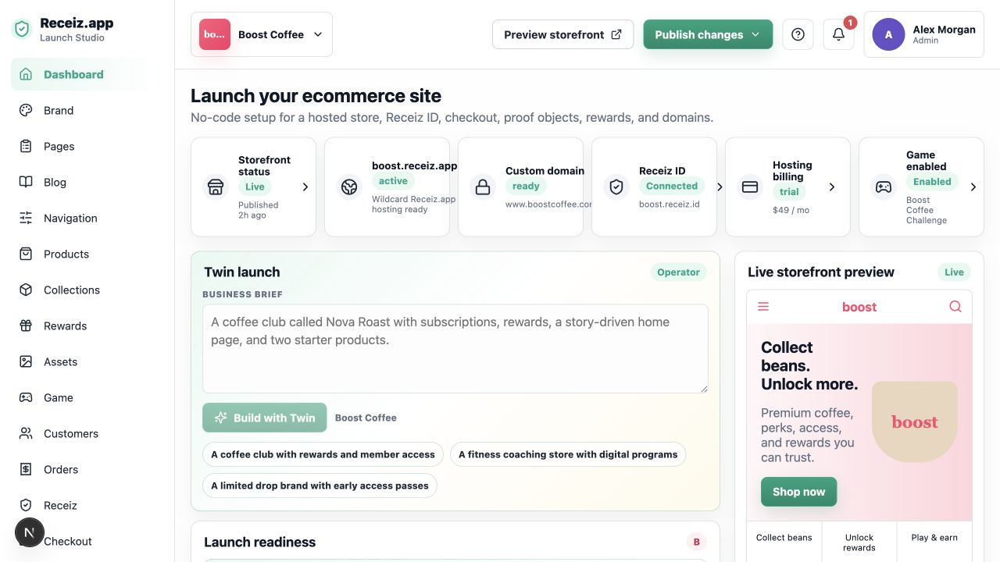
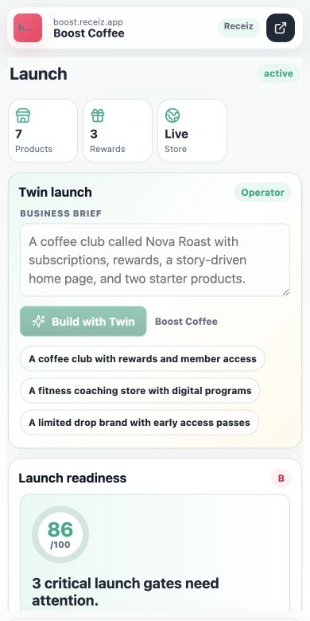
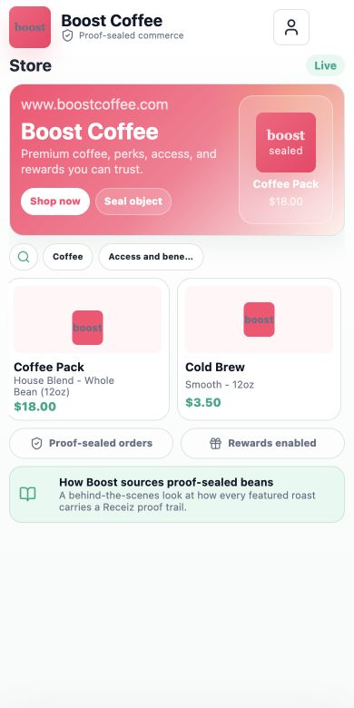
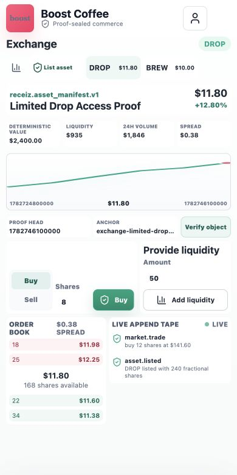

# Receiz Commerce OS v2 Baseline Audit

**Captured:** 2026-07-13  
**Scope:** Merchant launch studio, mobile launch, mobile storefront, mobile Exchange, repository release baseline  
**Target:** Award-winning self-serve commerce OS with an enterprise-forkable kernel

## Overall verdict

Receiz already has an unusually ambitious and differentiated foundation. The mobile product is the strongest part: it feels purpose-built, branded, and usable. The largest v2 risk is that several surfaces visually imply a fully live operating system while some critical truth remains local or simulated. Version 2 should preserve the product's personality while making every important claim durable, sourced, recoverable, and operationally complete.

## 1. Desktop merchant launch

**Health:** Good foundation, overloaded hierarchy

Strengths:

- Clear publish action, storefront preview, launch score, and AI launch entry.
- The live preview makes brand work tangible.
- Dense operational coverage proves the product is more than a landing-page builder.

UX risks:

- Nineteen primary navigation items make every capability look equally important.
- Status cards, Twin, readiness, preview, and long-form configuration compete for first attention.
- Proof and infrastructure language appears before the merchant's next commercial action is clear.

Accessibility risks:

- Small sidebar and status-card text may become difficult under zoom.
- Compact controls need keyboard focus and target-size verification.
- The screenshot cannot prove focus order, screen-reader announcements, or contrast compliance.

Highest-impact change: replace the flat capability list with Home, Sell, Operate, Grow, Money, and Settings; show a role-aware next-action queue on Home.

## 2. Mobile merchant launch

**Health:** Strong, with an overly long readiness path

Strengths:

- The mobile header, status summary, Twin brief, and bottom navigation form a coherent launch tool.
- Layout and control density are substantially better than a simple desktop collapse.
- Example briefs make AI assistance approachable.

UX risks:

- The primary view becomes a long readiness report before everyday operations.
- The score changed between inspected states, which needs a clearly explained recalculation source.
- “Receiz” and the external-arrow action are not self-explanatory to a first-time merchant.

Accessibility risks:

- Small secondary copy and pills require contrast and dynamic-type testing.
- Sticky navigation must not hide focused content at 200% text size.

Highest-impact change: make launch readiness a resumable setup mode, then graduate the merchant to a daily command center after launch.

## 3. Mobile storefront

**Health:** Very good visual direction

Strengths:

- Strong brand moment, compact product discovery, clear commerce actions, and useful proof/reward reassurance.
- The product rail and category controls fit the mobile viewport well.
- Proof is presented as customer value rather than developer infrastructure.

UX risks:

- “Seal object” competes with “Shop now” without explaining customer value.
- Only two visible products and large empty lower space make the captured state feel less alive than the platform's capability set.
- A user cannot tell from the storefront which data is live, published, or sample data.

Accessibility risks:

- Some hero copy sits on a saturated background and needs measured contrast.
- Truncated category text needs an accessible full name.
- Product cards require verified focus, selected, and activation behavior.

Highest-impact change: preserve this visual system, clarify the primary buying task, and attach source/freshness only where it builds trust without clutter.

## 4. Mobile Exchange

**Health:** Visually sophisticated, functionally not production-real

Strengths:

- Excellent density for a small viewport: market selector, proof reference, chart, order book, tape, trade, and liquidity actions are all present.
- Verification is directly accessible.
- The wallet-first concept is visible in the surrounding product model.

UX and integrity risks:

- The displayed “live” market, prices, order book, liquidity, volume, and trade tape are seeded/local projections.
- Trade execution does not open a durable settlement workflow.
- Wallet balance, card delta, pending payment, failure, and final ownership are not visibly confirmed in the mobile ticket.
- The screenshot contains black rendering regions at the top and bottom of this state; browser/device visual regression needs to catch this.
- “Deterministic value” is not a user-understandable or sourced valuation label.

Accessibility risks:

- Dense uppercase labels and small numerical text need zoom and contrast testing.
- The chart needs a textual summary and table equivalent.
- Buy/sell selection, price changes, and settlement updates need programmatic state announcements.

Highest-impact change: rebuild the Exchange around verified asset ingestion, durable orders, price-time matching, real wallet/card settlement, ownership append, and recovery; label reference value, listing price, indicative price, and settled market price separately.

## 5. Theme persistence journey

**Health:** Misleading save semantics

The brand editor previews palette changes through root CSS variables and platform state is cached locally. However, `Save theme` only marks the checklist and adds a local proof event. Public tenant state changes only through the separate full publish workflow. The label therefore promises global persistence that the action does not perform.

Highest-impact change: implement a versioned server draft with autosave, rename the local action, add a signed `Publish theme` mutation, invalidate tenant/custom-domain projections, and verify the result across reload, tabs, devices, and hosts.

## Repository and release baseline

**Health:** Strong engineering baseline with known release gaps

- 181 automated tests passed.
- TypeScript and ESLint passed.
- Secret scan passed across 329 tracked files.
- Receiz doctor returned `ok: true`, no missing rails, and no warnings.
- The installed SDK is 98.0.0; the latest SDK and MCP releases are 99.0.0.
- Production dependency audit found one moderate PostCSS advisory.
- The Exchange domain tests explicitly validate locally minted trade and liquidity projections; they do not prove remote settlement.
- The central store and storefront files are 3,473 and 2,074 lines, increasing change and test risk.

## Highest-impact v2 sequence

1. Upgrade SDK/MCP to 99.0.0, resolve the advisory, and add compatibility gates.
2. Introduce versioned private drafts and correct global theme publishing.
3. Split state by business domain and establish server command boundaries.
4. Replace local Exchange execution with durable verified market and settlement services.
5. Complete orders, inventory, fulfillment, returns/refunds, customers, finance, and multi-location operations.
6. Reframe navigation around merchant jobs and progressive capability activation.
7. Add safe AI/MCP commands with scopes, preview, confirmation, idempotency, and audit receipts.
8. Finish accessibility, performance, visual regression, security, load, and recovery release gates.

## Evidence limits

This audit used fresh local browser captures and repository checks. It does not claim full WCAG compliance, production performance, legal readiness for public real-money markets, or exhaustive security coverage. Those require dedicated assistive-technology testing, production/RUM data, legal review, and the full security scan workflow.

